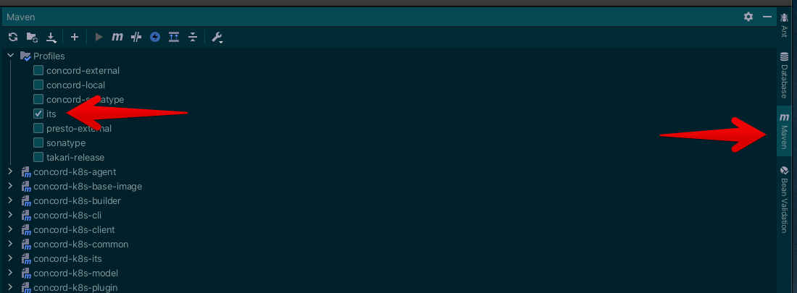
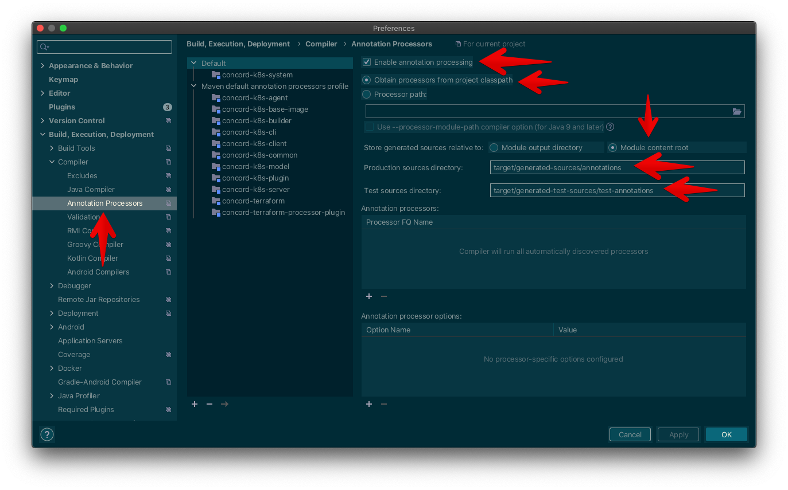

# Concord K8s System

A general-purpose Kubernetes provisioning system.

## Prerequisites

- Bash 5.0
- Java 17
- docker-compose
- Intellij IDEA 2021.2+

## Building and testing

`./mvnw clean install`

## Working in Intellij

Import the project into Intellij using the CLI script with `idea pom.xml` or use the Maven view and hit the `[+]` button and select the `concord-k8s-system` parent `pom.xml`.

When the `concord-k8s-system` project is imported, you will want to enable the `its` profile so that Intellij will import the `concord-k8s-its` module. This way you can work with
the end to end integration tests inside Intellij. The `concord-k8s-its` module is not enabled by default with the Maven CLI as they take 40 minutes to run, but it's useful to see
the integration tests in Intellij.



The `concord-k8s-system` makes heavy use of [Immutables][1] which itself is reliant on annotation process to generate source files. So you need to enable annotation processing in
Intellij for the `concord-k8s-system` project. Navigate to the preferences and look for `Build, Execution, Deployment/Compiler/Annotation Processors` and configure your settings
according to the illustration below.



Once this is done, Immutables sources will be generated correctly without having to build with the Maven CLI first.

## Running Locally

After building and testing the docker images are ready to use.

Bring up the CK8s database, server and agent using Docker Compose.

```
cd ck8s-dev
./ck8s-dev/ck8s-start
```

If you want to bring up all the Dockers services in the foreground you can use this instead:

```
cd ck8s-dev
./ck8s-dev/ck8s-run`
```

Navigate to the Concord console:

`./ck8s-dev/ck8s-console`

The API token required to login has been copied to the clipboard, you just need to paste it into the login console. After logging in you should be able to see and navigate around
the Concord console.

[1]: https://immutables.github.io/

