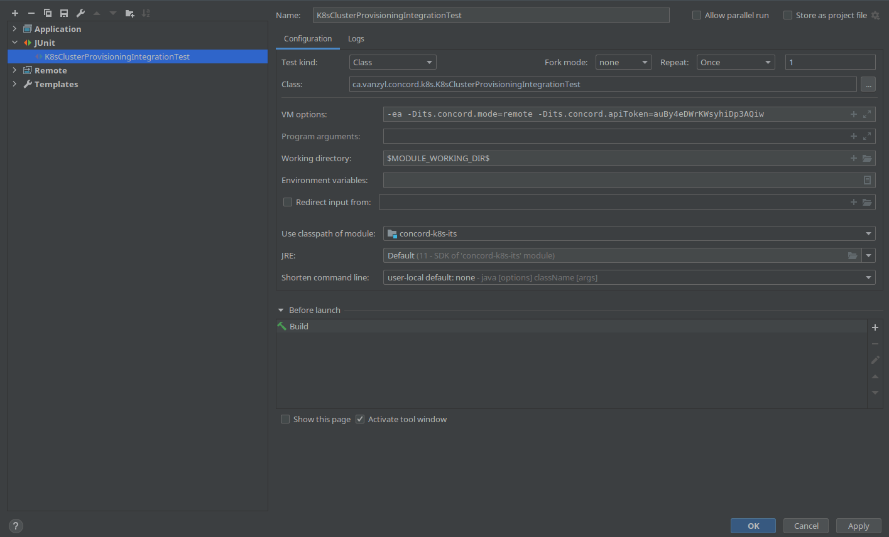

# Running concord-k8s-system in an IDE

- add docs on invalidating caches and rebuilding indexs as IDEA seems to get confused with annotation processing and all the Immutables classes appear to be broken a lot

It is possible to start *concord-k8s-system* in a "local development mode".

In this mode:

- Concord Server and Agent are running in the same JVM;
- flows, charts and other resources imported directly from the local file
  system;
- processes (flows) are executed in separate JVMs, as usual.

## Usage

To use this mode:

- build the project:
  ```
  ./mvnw clean install -DskipTests
  ```
  During the build, Maven installs the necessary runtime dependencies
  (e.g. the runner jar and the UI files).
- create a launch configuration in your IDE with the following
  parameters:
    - main class: `ca.vanzyl.concord.k8s.utils.Main`
    - working directory: the project's root directory.
      See [example](./dev/ck8s-local-dev.png).
- start the database:
  ```
  docker run -it --rm -p 5432:5432 -e 'POSTGRES_PASSWORD=q1' --name db library/postgres:10
  ```
- use the created launch configuration to start Concord.

The UI should be accessible on http://localhost:8001/#/login?useApiKey=true
The default API token is specified in the [local.conf](../concord-k8s-dev/conf/local.conf)
file.

Check [Concord's documentation](https://concord.walmartlabs.com/docs/getting-started/configuration.html#server-configuration-file)
for more options.

## Remote Debugging

To enable remote debugging for Concord processes, add `-Dck8s.remoteDebug=true`
to the VM options of the launch configuration. Use port `5005` to connect to
the running process.

## Integration Tests

By default, integration tests (the [concord-k8s-its](../concord-k8s-its) module) start
a new Concord instance using Docker. To use an already running instance of Concord,
specify the following JVM parameters:

```
-Dits.concord.mode=remote
-Dits.concord.apiToken=<token>
```

The `its.concord.apiToken` parameter is optional, the ITs use the default admin
token if no token provided.

By default, it uses `http://localhost:8001` as the base API URL. To use a different
address:

```
-Dits.concord.apiBaseUrl=https://concord.example.com
```

See the example:
.
